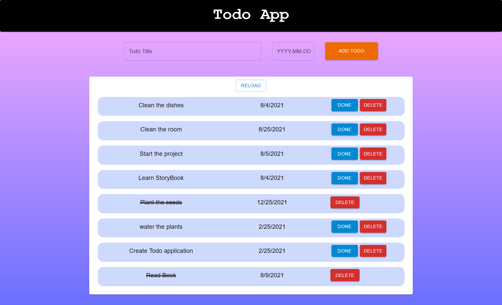

## Welcome! 👋

Todo Application -> Frontend

## Overview

Built with

- React 
- Typography
- SCSS
- Rdux
- Material-UI
- GitHub

Main components of the layout template
1. Header
2. Add Todo
3. Todo List

## Installation

1. save the file locally    ->    Clone the repository
2. installation             ->    npm install or yarn install
3. run the Todo app         ->    npm start or yarn start 

## User Guide

1. Add a todo
Enter the todo title/body in the text field 
Enter the End date in the next text field
Click Add Todo Button

2. Load the Todos
Click the refresh button

3. Update or Delete Todo
Click the update button to update the todo state to mark as Done
Click the delete button to delete the todo 

## Visit repository 

- [GitHub](https://github.com/Shameera17/TodoApp-FrontEnd)